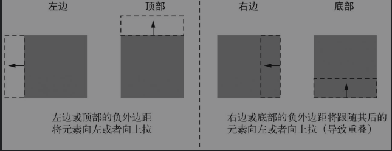

# 深入css

## 层叠优先级继承

### 选择器优先级

1. 判断css来源 一般来说有 浏览器给的默认样式，内联样式，行内样式，外联样式。
2. 内联>行内>=外联>默认。 继承样式优先级很小。比如a元素无法通过继承改变样式，需要指定修改。
3. 权限 内联>id>class >元素 。但是强烈建议不使用id，因为一个id大于n个class的组合，如果在很复杂的样式组合中，我们可能出现，修改class的样式，没有生效，在那里 找id找半天的情况。
4. ！import 同上。优先级会提到最高。注意：！import 对继承设置没有啥作用，！import只是作用于当前选中的元素，而不是继承的元素。
5. 所谓层叠性。就是如果几个权重一样的样式，选中相同的元素。谁在后面会覆盖前面的样式。因为css不可能存在两个下padding或者两个上padding，后面的会覆盖前面的设置。

### 继承

1. color font font-family  font-size  font-weight	font-variant  font-style	line-height	letter-spacing 	text-align	text-index	text-transform	white-space以及	word-spacing
2. list-style   list-style-type  list-style-position    list-style-image    border-collapse   border-spacing
3. 以上都可以被继承。字体，列表设置样式，表格的边框设置 。

### 特殊值

1. inherit 继承   比如设置color：inherit 表示从父元素继承颜色值。
2. initial 表示撤销元素的样式。 回归默认样式。

### 样式简写

1. 样式可以简写 比如 font:normal bold 18px/1.2 "微软雅黑"  实际上 font-style  font-weight font-size/line-height一次设置了。注意简写会覆盖之前设置的。如果我们单独设置某个样式必须在简写之后。
2. 简写的顺序 比如 border 设置的四个顺序是上右下左   三个是上   左和右   下    两个是上和下   左和右
3. background -position  设置的是第一个是水平方向第二个垂直方向的值。

## 相对单位

### em和rm

1. 1em等于当前字体的字号。
2. em定义字号的时候 font-size：1.2em 表示为继承的样式字号的1.2倍。
3. 如果一个元素的字号em设置和其他样式也使用了em。会先计算字号em最后根据字号，再去渲染其他样式的em值。
4. em作用于多层继承字号上，会照成难以维护的问题。因为字体全部都是计算得来，你难以记忆。所以字号不用em设置最好。这里推荐使用rem。
5. rem 是根据html根节点设置的字号来计算的。这样有一个统一的确定值。
6. px  rem em 如何选择。字号 rem或者px  边框必须是px因为需要固定大小  em可以设置其他大多数样式。
7. 移动布局中如果要做根据屏幕不同伸缩大小，各大网站的解决方案中最好的就是rem。

### 视口

1. vh 视口高度的1/100
2. vw 视口宽度的 1/100
3. 比如视口宽度一半就是50vw  高度一半就是50vh
4. vmin vmax  表示视口最小和最大限度  ie支持很差，即使edge也是。 其实简单来说你可以看做是min-width max-width之类的。
5. calc() css函数，用于计算支持+ - * /  注意计算两边有空格   font-size:calc(0.5em + 1vw) 很强大
6. calc() 和视口单位实现了自动缩放的功能。缺点是必须要很新的浏览器才支持。

### 无单位样式

1. line-height 可以设置无单位 这个时候行高是字体的倍数  line-height：1.2 就是1.2倍
2. line-height 应该不使用em这种，因为如果行号小于字体大小会出现重叠的问题。
3. 实际上行高这类可以在body中统一设置无单位，然后后面有特殊需求后再设置。

### 你不知道的自定义属性

1. --main-font  有这个属性吗？ 没有！ 这个是自定义的，使用两个--进行区分。
2. 如何使用  --main-font:"微软雅黑"     font-family:var(--main-font) 即可调用
3. 自定义属性值可以修改，以达到动态改变的效果。
4. 使用js可以获取自定义变量动态改变样式。getComputedStyle 可以获取某个元素的样式，然后你可以去修改了
5. 自定义属性是css3的特性

## 盒子模型

### 元素宽度问题

1. 注意宽度默认是border+padding+width 你设置的宽度是width。如果你增加了border和padding，会改变实际盒子模型的宽度。
2. box-sizing 很重要的一个熟悉。从ie8开始就支持，默认是content-box。可以设置border-box，表示设置的宽度width包含了border和padding。
3. 块间隔使用margin。进行分开。

### 高度问题

1. 溢出问题。使用overflow属性可以控制容器的溢出。

2. 等高列。多个列高度相等。使用display:table . 每一列就是display:table-cell. 表格看起来高度都是相同的。缺点是margin不起作用，你要使用border-spacing 定义单元格的距离。同时配合margin 赋值。总结就是麻烦。

3. flex布局。 解决了等高列。缺点是ie9.以下不支持。

4. 但是建议不要设置一个容器高度。如果设置高度一半是为了布局。

5. min-height max-height  可以设置最低的高度。如果超出了就自动扩充

6. 垂直居中的。vertical-align 这个只是音像行内元素或者table-cell。 块内部文字居中单行，使用line-height和高度相同可以文本居中。或者给块设置上下padding，内容自动适应。

   > ​														垂直居中指南
   >
   > ​	在容器里让内容居中最好的方式是根据特定场景考虑不同因素。做出判断前，先逐个询问自己以下几个问题，直到找到合适的解决办法。其中一些技术会在后面的章节中介绍，可根据情况翻阅对应的内容寻找答案。
   >
   > 1. 可以用一个自然高度的容器吗？给容器加上相等的上下内边距让内容居中
   > 2. 容器需要指定高度或者避免使用内边距吗？对容器使用display: table-cell和vertical-align:middle。
   > 3. 可以用Flexbox吗？ 如果不需要支持IE9，可以用Flexbox居中内容。
   > 4. 容器里面的内容只有一行文字吗？设置一个大的行高，让它等于理想的容器高度。这样会让容器高度扩展到能够容纳行高。如果内容不是行内元素，可以设置为inline-block。
   > 5. 容器和内容的高度都知道吗？将内容绝对定位。（只有当前面提到的方法都无效时才推荐这种方式。）
   > 6. 不知道内部元素的高度？用绝对定位结合变形（transform）（还是只有当前面提到的方法都无效时才推荐该方法。）

   7. 设置负的外边距。使得容器按照反方向移动

   > 

   8. 文档流下的上下外边距合并。 这个问题很常见。就是一个有上下两个块，一个有下部bottom一个有上部top 的margin，会合并为其中最大的一个外边距。 解决方法：第一你需要多高直接设置一个就好了。第二使用内边距解决。第三使用overflow：auto；触发bfc。第四浮动不存在这个问题。第五使用flex 或者table-cell。
   9. 猫头鹰选择器 `*+*` 其实就是个子代选择器。统一设置子代的边距等等。

   